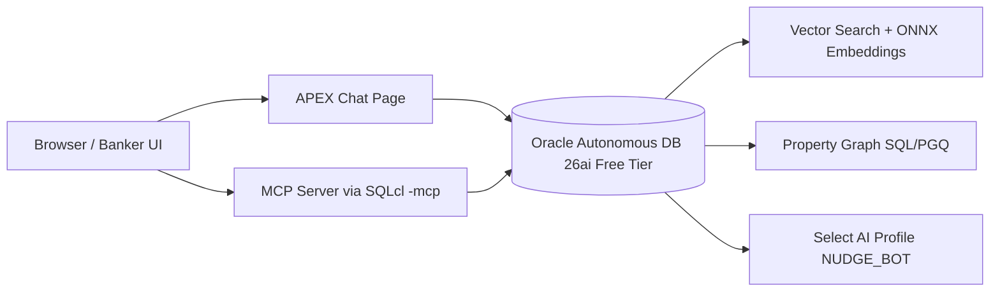

# Oracle 26ai Learning: Proactive Banking Nudges POC


This repository contains a runnable Oracle Autonomous Database 26ai Free Tier Proof-of-Concept for proactive banking nudges that combines relational data, BLOB/CLOB content, AI Vector Search, Property Graph (SQL/PGQ), Select AI, MCP integration, and an APEX chat front end across three use cases: credit-card page view nudges, abandoned-application nudges, and declined-transaction nudges.

## Architecture



## Repository Layout

```text
oracle-26ai-learning/
├── README.md
├── LICENSE
├── requirements.txt
├── scripts/
│   ├── 00_setup_kaggle.sh
│   ├── 01_download_all.sh
│   ├── 02_trim_lending.py
│   ├── 03_gen_conversations.py
│   └── 04_upload_to_oci.sh
├── sql/
│   ├── 01_schema.sql
│   ├── 02_staging_ddl.sql
│   ├── 03_load_onnx_model.sql
│   ├── 04_copy_data.sql
│   ├── 05_transform.sql
│   ├── 06_embed_and_index.sql
│   ├── 07_property_graph.sql
│   ├── 08_select_ai_profile.sql
│   ├── 09_uc1_card_view.sql
│   ├── 10_uc2_abandoned_app.sql
│   └── 11_uc3_declined_txn.sql
├── apex/
│   └── nudge_chat_app.sql
├── mcp/
│   └── README.md
└── docs/
    ├── architecture.md
    ├── dataset-licenses.md
    └── demo-script.md
```

## Quick Start

1. Install Python dependencies:
   ```bash
   pip install -r requirements.txt
   ```
2. Prepare Kaggle:
   ```bash
   ./scripts/00_setup_kaggle.sh
   ```
3. Download datasets:
   ```bash
   ./scripts/01_download_all.sh
   ```
4. Trim LendingClub to 5k rows:
   ```bash
   python3 scripts/02_trim_lending.py \
     --input data/raw/lendingclub/accepted_2007_to_2018Q4.csv \
     --output data/processed/lendingclub_5k.csv
   ```
5. (Optional) Generate templated conversations:
   ```bash
   python3 scripts/03_gen_conversations.py \
     --input data/raw/banking77/banking77.csv \
     --output data/processed/banking77_conversations.csv
   ```
6. Upload files to OCI Object Storage:
   ```bash
   OCI_NAMESPACE=<ns> OCI_BUCKET_NAME=<bucket> ./scripts/04_upload_to_oci.sh
   ```

## SQL Run Order (Required)

1. `sql/01_schema.sql`
2. `sql/02_staging_ddl.sql`
3. `sql/03_load_onnx_model.sql`
4. `sql/04_copy_data.sql`
5. `sql/05_transform.sql`
6. `sql/06_embed_and_index.sql`
7. `sql/07_property_graph.sql`
8. `sql/08_select_ai_profile.sql`
9. `sql/09_uc1_card_view.sql`
10. `sql/10_uc2_abandoned_app.sql`
11. `sql/11_uc3_declined_txn.sql`

## 5-Day Build Plan

| Day | Deliverable |
|---|---|
| 1 | Provision ADB, run `01_schema.sql`, load 50 fake customers / 200 txns / 20 conversations |
| 2 | Load ONNX model, embed conversations + product docs, build vector index |
| 3 | Build property graph, write the 3 nudge queries |
| 4 | Wire Select AI profile + MCP; test from SQLcl/Claude |
| 5 | Build APEX chat page, record demo of all 3 UCs |

## Cost Guardrails

- Use Oracle Autonomous Database 26ai Free Tier resources only.
- Keep storage and object uploads within free quotas.
- If OCI GenAI is enabled for Select AI, set an OCI budget alert at **$5**.

## License

Code in this repository is licensed under MIT. Dataset licensing and redistribution notes are in `docs/dataset-licenses.md`.
