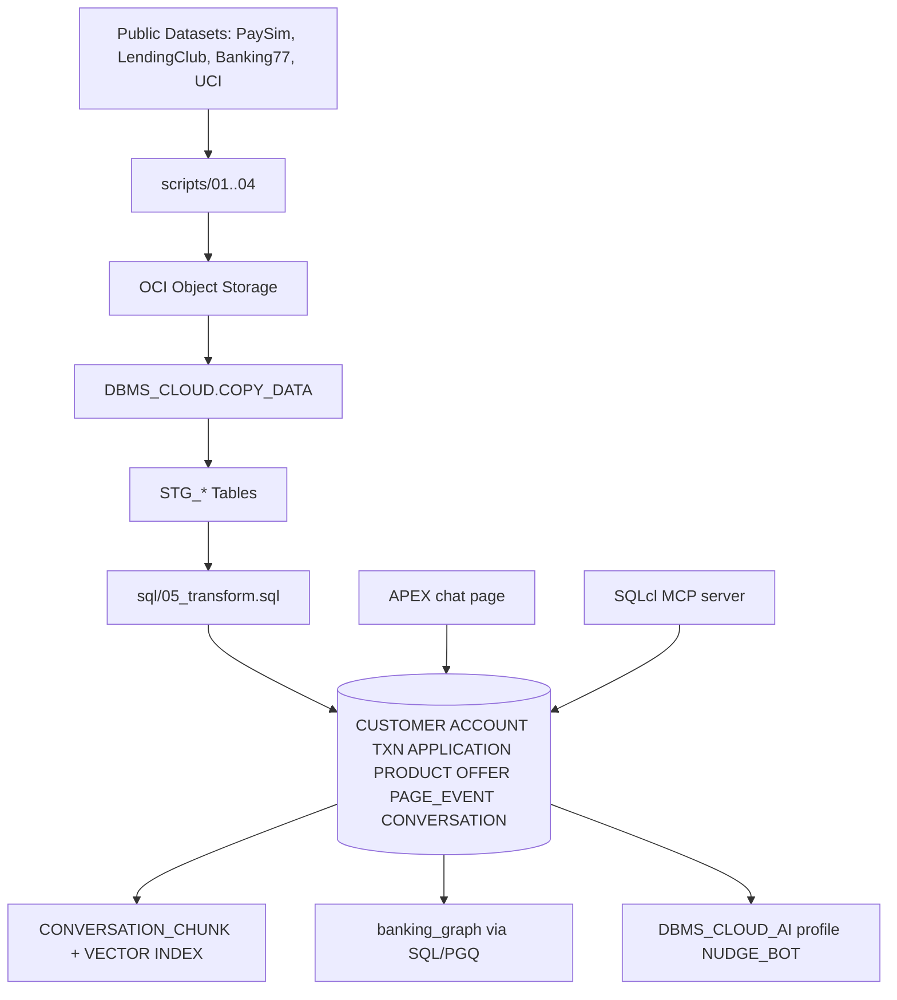

# Architecture

```mermaid
flowchart TD
    Datasets[Public Datasets: PaySim, LendingClub, Banking77, UCI] --> Scripts[scripts/01..04]
    Scripts --> Obj[OCI Object Storage]
    Obj --> Load[DBMS_CLOUD.COPY_DATA]
    Load --> Staging[STG_* Tables]
    Staging --> Transform[sql/05_transform.sql]
    Transform --> Core[(CUSTOMER ACCOUNT TXN APPLICATION PRODUCT OFFER PAGE_EVENT CONVERSATION)]
    Core --> Vector[CONVERSATION_CHUNK + VECTOR INDEX]
    Core --> Graph[banking_graph via SQL/PGQ]
    Core --> SelectAI[DBMS_CLOUD_AI profile NUDGE_BOT]
    APEX[APEX chat page] --> Core
    MCP[SQLcl MCP server] --> Core
```
