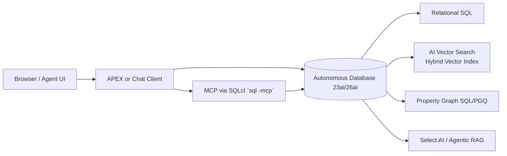

# Oracle 23ai/26ai Proactive Banking Nudges POC

This repository is a runnable proof-of-concept for Oracle Autonomous Database 23ai/26ai showing proactive banking nudges using one converged platform: relational data for customer/account state, vector search for semantic retrieval, SQL/PGQ property graph for relationship traversal, and agentic RAG via Select AI + MCP for natural-language tool orchestration.

## Always Free resource footprint

| Resource | Tier | Role in this POC |
|---|---|---|
| Autonomous Database 23ai (ATP/ADW) | Always Free | Core relational + vector + graph + Select AI SQL runtime |
| Object Storage | Always Free (20 GB) | Dataset/object staging for `DBMS_CLOUD.COPY_DATA` |
| APEX (built into ADB) | Included | Optional lightweight nudge chat UI |
| Compute A1 VM | Always Free | Optional SQLcl + MCP host |

## Architecture

Extended architecture details: [docs/architecture.md](docs/architecture.md)

## Prerequisites

- OCI account with an Always Free Autonomous Database.
- Kaggle account and API token (`kaggle.json`).
- OCI CLI configured (`oci setup config`).
- SQLcl installed (for SQL + MCP workflows).
- Python 3.10+ for helper scripts.

## Run order

1. Provision Always Free ADB and Object Storage bucket.
2. Run `sql/01_schema.sql`.
3. Run `sql/02_staging_ddl.sql`.
4. Run `sql/03_load_onnx_model.sql`.
5. Download datasets (`scripts/00_setup_kaggle.sh`, `scripts/01_download_all.sh`, `scripts/02_trim_lending.py`, `scripts/03_gen_conversations.py`).
6. Upload staged CSVs (`scripts/04_upload_to_oci.sh`).
7. Run `sql/04_copy_data.sql`.
8. Run `sql/05_transform.sql`.
9. Run `sql/06_embed_and_index.sql`.
10. Run `sql/07_property_graph.sql`.
11. Run `sql/08_select_ai_profile.sql`.
12. Execute UC SQL scripts `sql/09_uc1_card_view.sql`, `sql/10_uc2_abandoned_app.sql`, `sql/11_uc3_declined_txn.sql`.

## Use case demos

- **UC1:** card page view nudge from relational + graph + vector retrieval.
- **UC2:** abandoned application nudge using similar prior abandoned conversations and Select AI summary.
- **UC3:** declined transaction nudge generated agentically from recent account context.

## Cost guardrails

- Keep all compute/database resources on Always Free shapes.
- If enabling OCI Generative AI, add a **$5 OCI Budget alert** before testing Select AI prompts.
- Delete or lifecycle raw object payloads after demos to stay inside free storage limits.

## Additional guides

- [APEX page setup](apex/nudge_chat_app.md)
- [MCP configuration](mcp/README.md)
- [Dataset licenses](docs/dataset-licenses.md)
- [5-day demo script](docs/demo-script.md)
