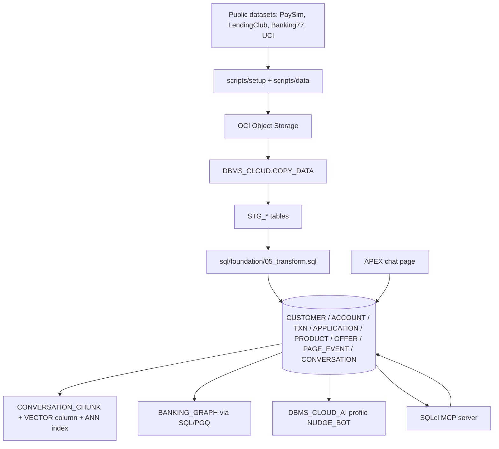

# Oracle 26ai Banking Demo Documentation

## Purpose

This document is the canonical technical and training manual for the Oracle 26ai proactive banking nudges demo. It consolidates the prior chapter set into one formal documentation book. The intended audience includes application engineers, DBAs, platform engineers, risk and compliance reviewers, and marketing or servicing operations teams responsible for implementation, review, and controlled operation.

The document is written as documentation, not as presentation material. Its purpose is to define the system, explain the execution model, describe the control surface, and provide the operating and training guidance required to run the demo and evaluate it as a bank-grade design.

## Table of Contents

1. Scope and operating model
2. Repository and operational taxonomy
3. Setup and prerequisites
4. Data preparation
5. Database build and SQL run order
6. Architecture and data model
7. Core Oracle 26ai primitives
8. Query, retrieval, and execution patterns
9. Use-case model
10. Integration surfaces
11. Governance and training model
12. Operations and controls
13. Demo run procedure
14. Dataset licenses and redistribution
15. Readiness and exit criteria
16. Cleanup

## 1. Scope and operating model

The demo addresses three high-intent customer moments:

1. Credit card page view.
2. Abandoned application.
3. Declined transaction.

These moments are chosen because they require timely action while customer context is still active and because they force clear separation between marketing-class and servicing-class communication.

The operating model combines two business objectives in one governed path.

- Banking objective: improve decision quality, preserve servicing correctness, and keep every action auditable.
- Marketing objective: improve contextual relevance, conversion timing, suppression discipline, and attribution readiness.

The system is designed to improve action quality without moving the source data into separate vector, graph, or agent platforms.

## 2. Repository and operational taxonomy

The repository is organized by operational phase rather than by a flat numbered script list.

| Phase | Purpose | Primary paths |
| --- | --- | --- |
| Setup | Local environment bootstrap and credentials preparation | `scripts/setup/` |
| Data preparation | Dataset download, shaping, and upload | `scripts/data/` |
| Database build | Schema, staging, ONNX model load, transform, graph, vector, and runtime support | `scripts/db/`, `sql/foundation/`, `sql/ai/`, `sql/runtime/` |
| Use-case run | Direct execution of UC1, UC2, and UC3 | `sql/use-cases/`, `scripts/demo/` |
| Integration | MCP, APEX, and Spring-facing SQL and service surfaces | `sql/integration/`, `mcp/`, `spring/` |
| Cleanup | Removal of generated data, local build output, and local Oracle container state | `scripts/cleanup/` |

This taxonomy is used consistently in the documentation and in the execution path.

## 3. Setup and prerequisites

### 3.1 Environment assumptions

The demo assumes Oracle Autonomous Database 26ai or a local Oracle 26ai-compatible environment, a Python runtime for helper scripts, and SQLcl or SQL*Plus for SQL execution. For Spring validation, Maven is required, although it may not be present in every local workspace.

### 3.2 Local environment setup

Run the setup phase before any data or database work.

```bash
source scripts/setup/setup_venv.sh
./scripts/setup/setup_kaggle.sh
```

These scripts create or reuse the local virtual environment, install dependencies, and validate Kaggle credentials for dataset acquisition.

### 3.3 Operational prerequisites

The following conditions should be met before continuing:

- A dedicated Oracle schema or demo database is available.
- Dataset credentials are configured where needed.
- OCI Object Storage details are available if Autonomous Database loading will be used.
- SQLcl or SQL*Plus is installed if SQL scripts will be executed from the shell.

## 4. Data preparation

Dataset acquisition and shaping are intentionally separated from database build.

### 4.1 Source datasets

- PaySim for transaction simulation and decline behavior.
- LendingClub for application lifecycle data.
- Banking77 for conversation and intent seed text.
- UCI Bank Marketing for optional product and campaign context.

### 4.2 Data preparation commands

```bash
./scripts/data/download_datasets.sh
python3 scripts/data/trim_lending.py --input data/raw/lendingclub/accepted_2007_to_2018Q4.csv --output data/processed/lendingclub_5k.csv
python3 scripts/data/generate_conversations.py --input data/raw/banking77/banking77.csv --output data/processed/banking77_conversations.csv
OCI_NAMESPACE=<ns> OCI_BUCKET_NAME=<bucket> ./scripts/data/upload_to_oci.sh
```

### 4.3 Rationale

This phase exists to preserve lineage and repeatability.

- Raw acquisition remains separate from transformation.
- Staged files can be reloaded without repeating downloads.
- Data shaping remains visible and reviewable before it enters the core schema.

## 5. Database build and SQL run order

The database build is intentionally linear. The derived layers depend on the cleaned relational schema and on the ONNX model being available before embeddings are created.

### 5.1 Foundation SQL

1. `sql/foundation/01_schema.sql`
2. `sql/foundation/02_staging_ddl.sql`
3. `sql/foundation/03_load_onnx_model.sql`
4. `sql/foundation/04_copy_data.sql`
5. `sql/foundation/05_transform.sql`

### 5.2 AI SQL

1. `sql/ai/06_embed_and_index.sql`
2. `sql/ai/07_property_graph.sql`
3. `sql/ai/08_select_ai_profile.sql`

### 5.3 Runtime SQL

1. `sql/runtime/12_app_runtime_tables.sql`

### 5.4 Integration SQL

1. `sql/integration/13_mcp_peer_products_tool.sql`
2. `sql/integration/14_apex_nudge_chat_api.sql`

### 5.5 Execution commands

```bash
./scripts/db/start_oracle_container.sh
./scripts/db/run_sql_sequence.sh --connect user/password@dsn sql/foundation/01_schema.sql sql/foundation/02_staging_ddl.sql sql/foundation/03_load_onnx_model.sql sql/foundation/04_copy_data.sql sql/foundation/05_transform.sql sql/ai/06_embed_and_index.sql sql/ai/07_property_graph.sql sql/ai/08_select_ai_profile.sql
./scripts/db/run_sql_sequence.sh --connect user/password@dsn sql/runtime/12_app_runtime_tables.sql
./scripts/db/install_app_sql_extensions.sh --connect user/password@dsn
```

## 6. Architecture and data model

The demo is a converged Oracle Database 26ai design. The relational schema remains the system of record. Vectors, graph traversal, and governed generation extend the same data boundary rather than replacing it.

### 6.1 Design principle

Keep the source of truth in Oracle Database 26ai.

- Extend the existing schema rather than replacing it.
- Store vectors in the same database as the source rows.
- Expose graph semantics as an overlay on relational data.
- Use APEX and MCP as delivery surfaces, not as separate systems of record.

### 6.2 Architecture flow


```mermaid
flowchart TD
    Datasets[Public datasets: PaySim, LendingClub, Banking77, UCI] --> Scripts[scripts/setup + scripts/data]
    Scripts --> Obj[OCI Object Storage]
    Obj --> Load[DBMS_CLOUD.COPY_DATA]
    Load --> Staging[STG_* tables]
    Staging --> Transform[sql/foundation/05_transform.sql]
    Transform --> Core[(CUSTOMER / ACCOUNT / TXN / APPLICATION / PRODUCT / OFFER / PAGE_EVENT / CONVERSATION)]
    Core --> Vector[CONVERSATION_CHUNK + VECTOR column + ANN index]
    Core --> Graph[BANKING_GRAPH via SQL/PGQ]
    Core --> SelectAI[DBMS_CLOUD_AI profile NUDGE_BOT]
    Core --> MCP[SQLcl MCP server]
    APEX[APEX chat page] --> Core
    MCP --> Core
```

### 6.3 Data model evolution

| Existing asset | Addition in 26ai | Outcome |
| --- | --- | --- |
| Customer, account, transaction, application tables | No structural replacement | Preserve the system of record |
| Conversation transcripts and offer content | Chunking plus vector columns | Semantic retrieval over unstructured text |
| Foreign-key relationships across entities | Property graph definition | Traverse customer, product, offer, and event relationships |

The same table can hold relational attributes, JSON or CLOB content, and vector data. The AI features augment the row structure instead of forcing a second datastore.

### 6.4 Delivery surfaces

- APEX provides the banker-facing chat surface.
- SQLcl MCP exposes database functions as tools to an external model or agent.
- Spring provides a production-style service interface for API and MCP-style endpoint orchestration.

The delivery surface changes, but the data path remains the same.

## 7. Core Oracle 26ai primitives

The demo relies on a small number of 26ai-specific capabilities.

| Primitive | Role in the demo |
| --- | --- |
| `VECTOR` column | Stores semantic embeddings for conversation chunks and related text |
| ONNX embedding model | Converts text to vectors inside the database |
| ANN vector index | Supports low-latency nearest-neighbor retrieval |
| `VECTOR_EMBEDDING` | Materializes embeddings in SQL |
| `VECTOR_DISTANCE` | Measures semantic proximity |
| SQL/PGQ property graph | Traverses customer-product-event relationships |
| `DBMS_CLOUD_AI` profile | Governs model-backed generation for UC3 |

These primitives are important because each solves a different part of the same banking problem: exact policy filtering, relationship discovery, semantic retrieval, and governed language generation.

## 8. Query, retrieval, and execution patterns

### 8.1 Query shape

Precision comes from business filters. Semantic ranking resolves only the rows that have already passed the business rules.

```sql
SELECT /*+ expected: filter-first, then ANN */
       o.offer_id,
       o.offer_name,
       VECTOR_DISTANCE(o.offer_vec, :context_vec, COSINE) AS score
FROM   offers o
JOIN   customer_profile p ON p.customer_id = :customer_id
WHERE  p.segment = o.target_segment
  AND  o.product_family = 'CREDIT_CARD'
  AND  o.region = p.region
ORDER  BY score
FETCH FIRST 5 ROWS ONLY;
```

### 8.2 Vector retrieval pattern

The demo uses filter-first retrieval. A pure vector scan over the entire corpus is neither the preferred performance posture nor the preferred governance posture.

### 8.3 Vector index posture

The current demo uses an IVF-style index via `ORGANIZATION NEIGHBOR PARTITIONS` with cosine distance. This is a suitable default for filtered top-K retrieval paths. HNSW may be preferable when lower latency on less-filtered queries becomes the primary objective.

### 8.4 Property graph posture

The property graph is an overlay, not a second persistence model. It exposes customer, product, account, page event, and application relationships through `GRAPH_TABLE` while remaining in the same audit and backup boundary as the relational schema.

### 8.5 DBA framing

| New thing | DBA framing |
| --- | --- |
| `VECTOR` column | Fixed-length floating-point array stored with the row |
| ONNX embedding model | In-database function that converts text to vectors |
| Vector index | Index type for nearest-neighbor access |
| SQL/PGQ graph | View-like overlay on existing tables |
| Select AI profile | Package-level configuration for natural language to SQL |
| MCP server | External client surface exposing controlled tools |

### 8.6 Capacity planning

- Raw embedding bytes per row = dimensions × 4 for `FLOAT32`.
- Planned data segment = roughly 1.2x to 1.5x of raw embedding storage.
- Vector index = roughly 0.5x to 1.5x of raw embedding storage, depending on index type and tuning.
- Add 25% to 40% headroom for growth and rebuild churn.

Illustrative planning example for 2,000,000 offers at 384 dimensions:

- Raw embeddings: about 3.07 GB.
- Working data and index envelope: often about 5.5 GB to 11 GB before headroom.
- With 30% headroom: roughly 7 GB to 14.3 GB.

The correct planning process is to load a pilot dataset, build the index, and measure actual segment growth before final provisioning.

## 9. Use-case model

### 9.1 UC1: credit card page view

- Communication class: marketing.
- Banking requirement: deterministic eligibility boundaries must still hold.
- Marketing requirement: relevance must be contextual and in-session.

Execution pattern:

1. Detect recent card-page activity.
2. Use graph traversal to identify peer-viewed products.
3. Use vector retrieval to find the most relevant supporting conversation context.

### 9.2 UC2: abandoned application

- Communication class: marketing with workflow recovery intent.
- Banking requirement: application state and customer context must remain explainable.
- Marketing requirement: re-engagement must remain channel-safe and frequency-controlled.

Execution pattern:

1. Detect `STARTED` applications older than the threshold.
2. Use vector retrieval to surface context relevant to application completion.
3. Prepare controlled recovery messaging.

### 9.3 UC3: declined transaction

- Communication class: servicing.
- Banking requirement: explanation and next-step guidance must remain policy-safe and auditable.
- Marketing requirement: this flow must not be misclassified as promotional outreach.

Execution pattern:

1. Detect declined transaction state.
2. Use Select AI under a governed profile and wrapper path.
3. Return a servicing-safe nudge with fallback behavior if generation fails.

## 10. Integration surfaces

### 10.1 MCP

The MCP path exposes a governed database tool surface through SQLcl `-mcp`.

Key assets:

- `sql/integration/13_mcp_peer_products_tool.sql`
- `mcp/README.md`
- `scripts/mcp/claude_desktop_config.template.json`

The MCP tool catalog is a policy enforcement point. Tools should be typed, least-privilege, and audited. Arbitrary SQL passthrough is not part of the intended design.

### 10.2 APEX

The APEX-facing PL/SQL surface is installed through:

- `sql/integration/14_apex_nudge_chat_api.sql`

It provides a stable package signature that can be called from an APEX page process.

### 10.3 Spring service

The Spring service is a first-class part of the demo under `spring/`.

Its implemented capabilities include:

- UC1 and UC2 retrieval through Oracle Vector Search and property graph SQL.
- UC3 generation through `DBMS_CLOUD_AI.GENERATE`.
- MCP-style tool endpoints mapped to UC1, UC2, and UC3.
- marketing-versus-servicing API-key separation.
- correlation IDs returned to clients.
- circuit-breaker and fallback behavior for UC3.
- optional runtime logging to `offer_decision_log` and `mcp_tool_invocation_log`.

## 11. Governance and training model

The training model is built around the idea that the system generates regulated communications, not free-form strings.

### 11.1 Regulatory map

| Regime | Engineering impact |
| --- | --- |
| UDAAP | Content must be reviewable and reproducible |
| Reg B / ECOA | Protected-class attributes and proxies must not drive eligibility |
| FCRA | Adverse-action reasons must come from derivable inputs |
| Reg Z / Reg DD | Credit and deposit disclosures must stay in approved language |
| Reg E | Declined-transaction servicing is not marketing |
| GLBA | Transcript text, balances, and embeddings are controlled data |
| TCPA / CAN-SPAM | Channel consent, opt-out, and quiet hours apply |
| GDPR / CCPA | Retention, deletion, and disclosure duties apply |
| SR 11-7 / OCC 2011-12 | Model inventory, validation, and change control are required |
| PCI-DSS | PAN, CVV, and expiry must never be embedded |
| Records management | Prompts, outputs, and decision artifacts are records |

### 11.2 Training outcomes

The training should enable a reader to explain:

- why embeddings remain regulated bank data,
- why graph traversal can become a fair-lending issue,
- why generation must be wrapped and logged,
- why MCP named tools are safer than arbitrary SQL access,
- and why retention, legal hold, and audit evidence must be designed into the path.

### 11.3 Lab model

The active lab path is integrated into the SQL flow for `sql/ai/06..08` and `sql/use-cases/09..11`, with archived standalone lab SQL preserved under `.bak`.

## 12. Operations and controls

The nudge path must satisfy both banking control quality and marketing execution quality.

### 12.1 Golden signals

- Latency: end-to-end and component latency for vector, graph, eligibility, suppression, generation, and dispatch.
- Traffic: by use case, channel, offer family, and top-K size.
- Errors: SQL failures, wrapper failures, provider failures, fallback rate.
- Saturation: DB CPU, IO, memory, pool utilization, MCP concurrency, provider rate limits.

Bank-specific signals are equally important:

- suppression-bypass count,
- disclosure-substitution-failure count,
- UDAAP review-queue depth and age.

### 12.2 Reliability model

- CDC lag: serve stale but safe profile state and suppress risky nudges.
- Embedding or index lag: fall back to deterministic relational rules.
- Graph timeout: continue with relational and vector candidate sets.
- Delivery failure: persist the decision envelope for retry and replay.

### 12.3 Audit retention and legal hold

- `AI_CALL_LOG.retention_until` and `OFFER_DECISION_LOG.retention_until` are computed at insert time.
- Purge logic must consult `LEGAL_HOLD` before deletion.
- Erasure-on-request works only when no legal hold applies.

### 12.4 Cost control

- Tag by environment, use case, and offer family.
- Reconcile token usage against provider billing.
- Use deterministic fallbacks if provider degradation or cost spikes occur.

### 12.5 Fairness monitoring

If credit-product presentation is affected, fairness monitoring is required. Sample `OFFER_DECISION_LOG` by segment and product family, measure presentation and suppression rates, and route findings into a controlled compliance artifact.

## 13. Demo run procedure

The demo is intended to tell one integrated story: banking decision quality plus marketing execution quality.

### 13.1 Run sequence

1. Open Database Actions SQL Worksheet.
2. Run foundation and AI SQL in order.
3. Run `sql/runtime/12_app_runtime_tables.sql` if Spring APIs will be demonstrated.
4. Confirm the core tables contain data.
5. Demonstrate vector retrieval with a simple semantic query.
6. Run UC1 and explain graph plus vector candidate generation.
7. Run UC2 and explain compliant recovery marketing behavior.
8. Run UC3 and explain servicing classification and governed generation.
9. Optionally demonstrate APEX, MCP, or Spring API surfaces.
10. Close with cost, control, and free-tier scope.

### 13.2 Demonstration notes

- UC1 demonstrates graph narrowing plus semantic ranking.
- UC2 demonstrates re-engagement based on workflow state and conversation context.
- UC3 demonstrates governed generation with Select AI.
- At each use case, the communication class should be stated explicitly: marketing or servicing.

## 14. Dataset licenses and redistribution

This repository does not redistribute source datasets. It provides download and transform scripts only.

### 14.1 PaySim

- Source: `ealaxi/paysim1` on Kaggle.
- License: CC BY-SA 4.0.
- Use: transaction simulation for `TXN` and decline or fraud mapping in UC3.

### 14.2 LendingClub

- Source: `wordsforthewise/lending-club` on Kaggle.
- License terms: Kaggle Terms of Service and dataset page terms.
- Use: application lifecycle data for UC2.

### 14.3 Banking77

- Source: `hwassner/banking77` or equivalent HF dataset.
- License: CC BY 4.0.
- Use: seed intent text for synthetic conversation generation.

### 14.4 UCI Bank Marketing

- Source: UCI Machine Learning Repository.
- License: CC BY 4.0.
- Use: product and campaign context enrichment.

### 14.5 Redistribution policy

- Commit scripts only.
- Do not commit CSV, ZIP, ONNX model binaries, or credentials.
- Keep the data boundary explicit in review and sharing workflows.

## 15. Readiness and exit criteria

The documentation pass is complete only when a team can explain and execute the following:

1. The trigger logic for UC1, UC2, and UC3.
2. The architecture sequence: relational filter, graph traversal, vector ranking, governed generation, and decision logging.
3. Why vectors, graph, and logs stay in the same Oracle boundary.
4. Where suppression and opt-out checks run.
5. Where records-of-record are written and retained.
6. What the fallback path is for model, profile, or template degradation.
7. How to run the demo and interpret the outcome.
8. How to run the integrated lab checks and interpret PASS, FAIL, and MANUAL outcomes.

Expected handoff evidence includes:

- SQL run-order execution log.
- Demo walkthrough notes and sample outputs.
- Lab scoreboard output.
- Open items list for unresolved MANUAL controls.

## 16. Cleanup

Cleanup is an explicit operational phase.

### 16.1 Cleanup commands

```bash
./scripts/cleanup/purge_workspace_artifacts.sh
./scripts/cleanup/purge_generated_data.sh
./scripts/cleanup/stop_oracle_container.sh --remove
./scripts/demo/orchestrate.sh --mode container --stage cleanup
```

### 16.2 Cleanup intent

These commands remove:

- generated raw and processed demo data,
- local build and workspace artifacts,
- and the local Oracle container used for demo work.

Cleanup should be treated as part of the documented operating lifecycle rather than as an untracked local action.
