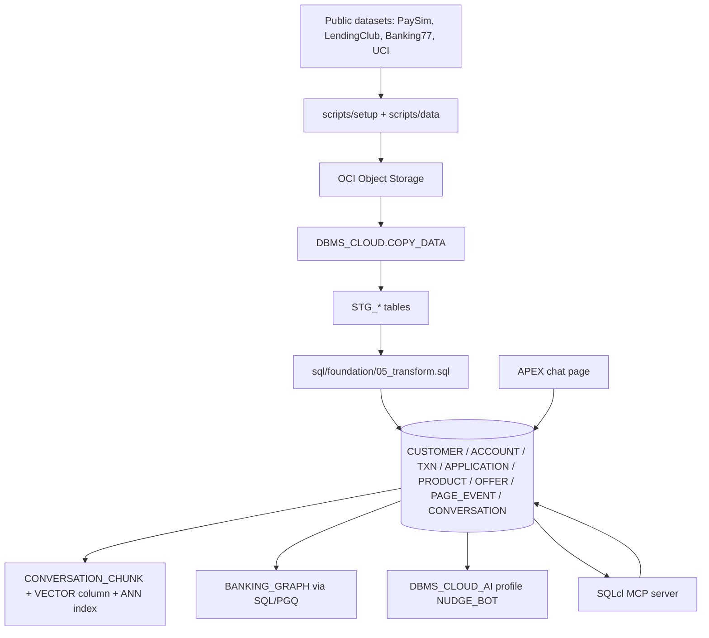

# Architecture

This POC keeps the system of record in Oracle Database 26ai and layers retrieval and orchestration on top of the same tables. The database stores the business entities, the transcript and content artifacts, the embedding vectors, and the graph overlay used for traversal.

For the merged design rationale and governance context, see [technical-reference.md](technical-reference.md).

## Data Flow

1. Public datasets are downloaded and trimmed by the scripts in `scripts/`.
2. Prepared files are uploaded to OCI Object Storage.
3. `DBMS_CLOUD.COPY_DATA` loads the staging tables.
4. `sql/foundation/05_transform.sql` normalizes the staged rows into the core relational schema.
5. `sql/ai/06_embed_and_index.sql` materializes the vector columns and builds the ANN index.
6. `sql/ai/07_property_graph.sql` defines the graph overlay on the same base tables.
7. `sql/ai/08_select_ai_profile.sql` registers the Select AI profile used by UC3.
8. `sql/integration/14_apex_nudge_chat_api.sql` and SQLcl MCP call the same database objects for runtime execution.

## Design Boundaries

- Relational rows remain the source of truth.
- Vector columns are derived artifacts stored in the same database.
- The graph layer is an overlay, not a separate persistence model.
- MCP and APEX are delivery surfaces, not data stores.
- All use cases execute inside the database boundary so the same security, audit, and retention controls apply.

## Runtime Components

| Component | Role |
|---|---|
| Oracle Database 26ai | Stores source rows, embeddings, graph views, and Select AI profile state |
| Vector search | Retrieves semantically similar conversations and content |
| SQL/PGQ property graph | Traverses customer, product, offer, and event relationships |
| Select AI | Produces the UC3 nudge through governed SQL generation |
| APEX | Presents the chat interface |
| SQLcl MCP | Exposes database functions as tools to an external agent |

## Execution Order

The SQL run order is intentionally linear until the derived layers are available. The vector index and graph overlay both depend on the cleaned relational tables, while the Select AI profile depends on the final schema objects. The use-case queries should be run only after those prerequisites exist.
